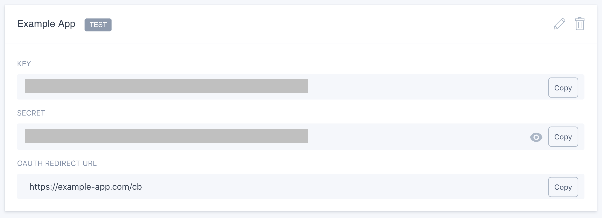
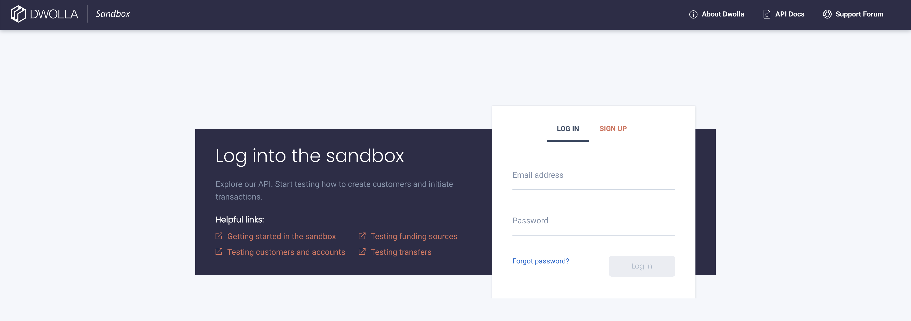
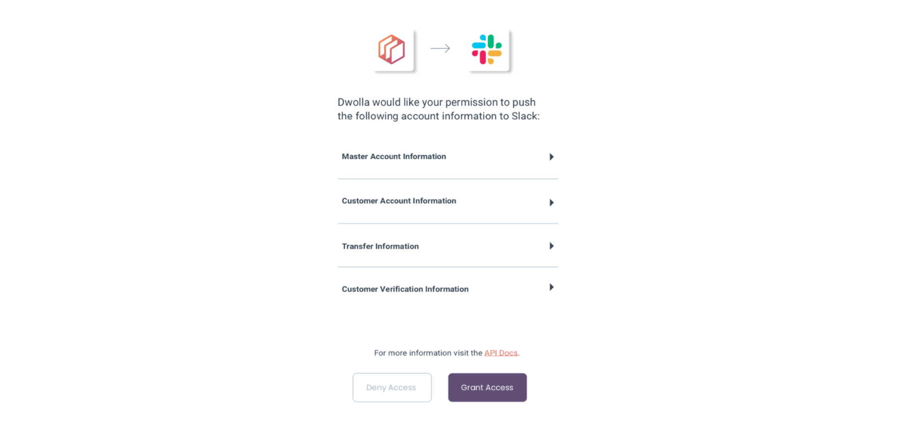

# Dwolla Integrations OAuth Flow Demo
A partner integration allows a Dwolla API Client to authenticate with Dwolla and authorize a third party application to interact with data stored in Dwolla via the application's user interface. With this authorization, you have the ability to create or view resources, or even receive webhooks.

Dwolla uses OpenID Connect which is a layer built on top of the OAuth 2.0 protocol to facilitate this authorization. The OpenID Connect flow is designed for web applications which leverages a browser-based interaction for user authentication.

### Table of Contents
* [Installation and Setup](#installation-and-setup)
* [Sandbox Configurations](#sandbox-configurations)
* [Usage](#usage)
* [Authorization Flow](#authorization-flow)
* [Additional Resources](#additional-resources)
* [Support](#support)
* [Contributing](#contributing-and-reporting-bugs)
* [License](#license)

### Installation and Setup
Use the package manager `npm` to install the required dependencies.

`npm install`

You will need to have a Dwolla Partner account to retrieve your Dwolla Key and Secret. [Sign up for a Dwolla Partner account](https://accounts.dwolla.com/sign-up/partner) and verify your email address. Once completed, navigate to the [`applications`](https://accounts.dwolla.com/login/partner) tab within the Partner Portal to create a test integration and retrieve your API Key/Secret.

### Request Authorization
Dwolla API Clients will need to accept authorization from your Integration in order for your integration to be able to read, write, or transact. Access tokens are short lived, and are only valid for one hour.

You will now want to add your clientId, clientSecret, and redirectURI to the project, being sure to url-encode all query strings.

To start the OpenID flow, construct the initiation URL which the user will visit in order to grant permission to your application. It describes who the Integration Application is (client_id), and where the user should be redirected to after they grant or deny permissions to your application (redirect_uri).

#### Example URL Format
https://accounts-sandbox.dwolla.com/auth?client_id=<clientId>&redirect_uri=<redirectUri>&response_type=code

For more information on these querystring parameters, visit our [developer docs](https://developers.dwolla.com/integrations/authorization#build-an-integration).

### Usage
Once the dependencies are installed, you can run `npm start` to start the application.
You will then be able to access it at localhost:9000/auth.

#### Request Authorization from API Client
The Dwolla Client will authenticate with their Dwolla Account.

Grant Authorization to partner integration application.
The user (Dwolla Client) will be prompted to grant or deny access to a set of permissions requested by your application

###### Grant Authorization to this integration app

###### Receive Code

#### Next Steps
After receiving this authorization code, you can now exchange it for an access token and refresh token pair. Check out our docs to learn more on these next steps.

### Further Resources
The Dwolla Developer portal is your go-to resource to learn more about the Dwolla API and its implementation.

##### Documentation for Dwolla Partner Integrations
Dwolla Partner Integrations

* Resources specific to a Partner Integration, including how to exchange the `code` you received for an access token

### Support
Support queries can be directed to our [Developer Forum](https://discuss.dwolla.com/). 

### Contributing and Reporting Bugs
Feel free to fork this repo and submit PRs for any corrections, new features, etc. you think we should include.

### License
The MIT License (MIT)

Copyright (c) 2019 Dwolla, Inc

Permission is hereby granted, free of charge, to any person obtaining a copy of this software and associated documentation files (the "Software"), to deal in the Software without restriction, including without limitation the rights to use, copy, modify, merge, publish, distribute, sublicense, and/or sell copies of the Software, and to permit persons to whom the Software is furnished to do so, subject to the following conditions:

The above copyright notice and this permission notice shall be included in all copies or substantial portions of the Software.

THE SOFTWARE IS PROVIDED "AS IS", WITHOUT WARRANTY OF ANY KIND, EXPRESS OR IMPLIED, INCLUDING BUT NOT LIMITED TO THE WARRANTIES OF MERCHANTABILITY, FITNESS FOR A PARTICULAR PURPOSE AND NONINFRINGEMENT. IN NO EVENT SHALL THE AUTHORS OR COPYRIGHT HOLDERS BE LIABLE FOR ANY CLAIM, DAMAGES OR OTHER LIABILITY, WHETHER IN AN ACTION OF CONTRACT, TORT OR OTHERWISE, ARISING FROM, OUT OF OR IN CONNECTION WITH THE SOFTWARE OR THE USE OR OTHER DEALINGS IN THE SOFTWARE.

