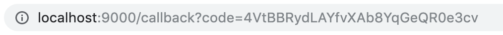

# Dwolla Integrations OAuth Flow Demo
A partner integration allows a Dwolla API Client to authenticate with Dwolla and authorize a third party application to interact with data stored in Dwolla via the application's user interface. With this authorization, you have the ability to create or view resources, or even receive webhooks.

Dwolla uses OpenID Connect which is a layer built on top of the OAuth 2.0 protocol to facilitate this authorization. The OpenID Connect flow is designed for web applications which leverages a browser-based interaction for user authentication.

### Table of Contents
* [Installation and Setup](#installation-and-setup)
* [Sandbox Configurations](#sandbox-configurations)
* [Usage](#usage)
* [Authorization Flow](#authorization-flow)
* [Additional Resources](#additional-resources)
* [Support](#support)
* [Contributing](#contributing-and-reporting-bugs)
* [License](#license)

### Installation and Setup
Use the package manager `npm` to install the required dependencies.

`npm install`

You will also need to have a Dwolla Sandbox account to retrieve your Dwolla Key and Secret.

[Sign up for a Dwolla Sandbox account](https://accounts-sandbox.dwolla.com/sign-up) and verify your email address. Once completed, navigate to the [`applications`](https://dashboard-sandbox.dwolla.com/applications-legacy) tab within the dashboard to retrieve your App Key/Secret.

### Sandbox Configurations
In order to get approved for testing as an Integration Partner, you will need to email `partnerships@dwolla.com` with the following fields:
* Subject line of: `Enable Sandbox Integrator`
* The email address you signed up with in Sandbox.
* The name of your Integration Application in Sandbox.
* The redirect URI that the authorization flow will redirect to after a Dwolla client grants permission to your integration. The redirect URI will be the endpoint that will handle receiving the code from Dwolla during the OpenID/OAuth flow (e.g. `http://localhost:9000/callback`).
* A logo to display with your integration. The logo should be a square high-res transparent PNG or JPG that is 150+ DPI (For example, 60px by 60px).
* A description that will be shown with your integration in Sandbox. (Optional, but recommended).
* A sign-up URL on your application that Dwolla Clients will be redirected to when enabling your integration. It is recommended you have users either login or (sign up for) your integration on this page. After you’ve authenticated the user, you will start the OpenID/OAuth flow with Dwolla. (Optional, but recommended).
* An informational URL that is a page on your application where Dwolla Clients can learn more about your integration. There is a “Learn More” link on your integration in Sandbox that will link to this URL. (Optional, but recommended).

Dwolla will alert you of the activation of your application via email. Once completed, you can move to the next steps.

### Usage
Once the dependencies are installed, you can run `npm start` to start the application.
You will then be able to access it at localhost:9000/auth.

You will now want to hardcode your applicationKey, applicationSecret, and redirectUri in `/routes/index.js`. **Note:** Your App Key and Secret should be kept private and not be pushed to a public repository.

#### Authorization Flow
Dwolla API Clients will need to grant authorization to your integration in order for your integration to be able to read, write, or transact. Access tokens are short lived, and are only valid for one hour.

To start the OpenID flow, construct the initiation URL which the user will visit in order to grant permission to your application. It describes who the Integration Application is (client_id), and where the user should be redirected to after they grant or deny permissions to your application (redirect_uri).

###### Example URL Format
https://accounts-sandbox.dwolla.com/auth?client_id={clientId}&redirect_uri={redirectUri}&response_type=code

For more information on these querystring parameters, visit our [developer docs](https://developers.dwolla.com/integrations/authorization.html).

###### The API Client will log into their dashboard

###### Grant Authorization to this integration app

###### Receive Code

#### Next Steps
After receiving this code, you can now exchange this for an access token and refresh token pair. Check out [our docs](https://developers.dwolla.com/integrations/authorization.html) to learn more on these next steps.

#### Additional Resources
##### [Dwolla Partner Integrations - Auth flow](https://developers.dwolla.com/integrations/authorization.html)
* Resources specific to a Partner Integration, including how to implement the authorization flow.

##### [Dwolla API Reference](https://docs.dwolla.com/)
* High level docs on every endpoint and API request/response

##### [Dwolla API Guides](https://developers.dwolla.com/guides/)
* Step-by-step guides on building on the Dwolla Platform

##### [Dwolla API Articles](https://developers.dwolla.com/resources/)
* Articles to help get started understanding the Dwolla API and to help gather requirements

### Support
Support queries can be directed to our [Developer Forum](https://discuss.dwolla.com/c/api-support).

### Contributing and Reporting Bugs
Feel free to fork this repo and submit PRs for any corrections, new features, etc. you think we should include!

### License
The MIT License (MIT)

Copyright (c) 2019 Dwolla, Inc

Permission is hereby granted, free of charge, to any person obtaining a copy of this software and associated documentation files (the "Software"), to deal in the Software without restriction, including without limitation the rights to use, copy, modify, merge, publish, distribute, sublicense, and/or sell copies of the Software, and to permit persons to whom the Software is furnished to do so, subject to the following conditions:

The above copyright notice and this permission notice shall be included in all copies or substantial portions of the Software.

THE SOFTWARE IS PROVIDED "AS IS", WITHOUT WARRANTY OF ANY KIND, EXPRESS OR IMPLIED, INCLUDING BUT NOT LIMITED TO THE WARRANTIES OF MERCHANTABILITY, FITNESS FOR A PARTICULAR PURPOSE AND NONINFRINGEMENT. IN NO EVENT SHALL THE AUTHORS OR COPYRIGHT HOLDERS BE LIABLE FOR ANY CLAIM, DAMAGES OR OTHER LIABILITY, WHETHER IN AN ACTION OF CONTRACT, TORT OR OTHERWISE, ARISING FROM, OUT OF OR IN CONNECTION WITH THE SOFTWARE OR THE USE OR OTHER DEALINGS IN THE SOFTWARE.
